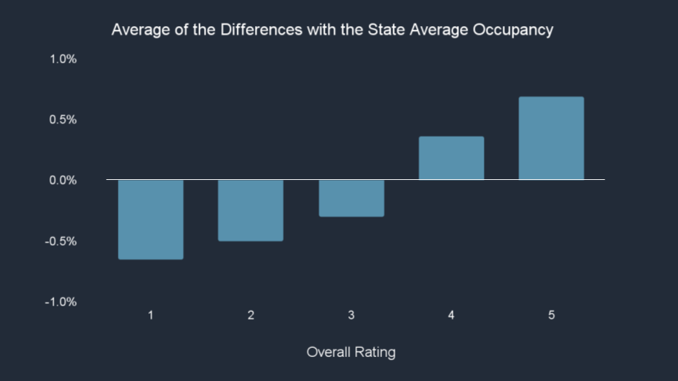

The goal of this project is to deliver a well-scoped project proposal and preliminary analysis to a struggling nursing facility with low occupancy to let them understand and accept how data science can help them increase the occupancy.

To start exploring this goal, I developed a written proposal and used the data of [Nursing Homes Including Rehab Services - Provider Information](https://data.cms.gov/provider-data/dataset/4pq5-n9py) on [Centers for Medicare & Medicaid Services](https://www.cms.gov/) to do preliminary analysis.

* Backstory
    * Occupancy at U.S skilled nursing facilities has been stable between 80% and 85% for years. However, there was a huge drop to about 70% in 2020 due to the pandemic. Many facilities have been facing challenges.
* Business Problem
    * How can nursing facilities with the occupancy below the national average or the average of its state increase its occupancy?
* Solution paths:
    * Build a regression model to interpret the factors of the occupancy.
* Impact hypothesis
    * By better understanding how the factors affect the occupancy, the nursing facilities can make more informed decisions about identifying and prioritizing which areas to improve to increase their occupancy.
* Measures of success:
    * Adjust R-squared is above 0.5.
    * The nursing facilities with the occupancy below the average of its state increase the occupancy to the average of its state.
* Risks and assumptions:
    * Risk: The information of marketing effort and the population structure of the regions  is lacking.
    * Assumption: The occupancy is correlated with the quality measures.
* Preliminary Analysis
    * The chart below shows the distribution of the occupancy at U.S. skilled nursing facilities. The mean of the occupancy was about 69% and 28% of the nursing facilities had more than 79% occupancy.

    * The chart below shows the average occupancy at U.S. skilled nursing facilities in each state. The result showed the occupancy varies among the states. We will need to consider the effect by the regions and control it in the model.

    * The chart below shows the average of the difference between the occupancy of each nursing facility and its state average occupancy. The result showed the trend that higher ratings had higher occupancy.

I will start to make the draft of the slides, continue with EDA, and build a baseline model. 
