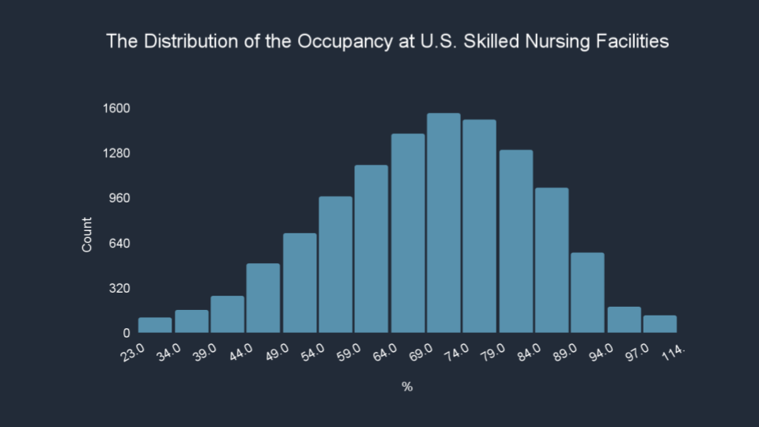
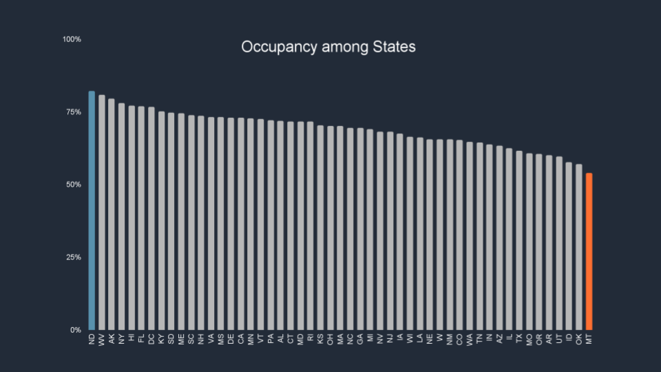

## Proposal for Nursing Facilities
###### Chien Yuan Chang

The goal of this project is to deliver a well-scoped project proposal and preliminary analysis to a struggling nursing facility with a low occupation rate to let them understand and accept how data science can help them increase the occupation rate.

To start exploring this goal, I developed a written proposal and used the data of [Nursing Homes Including Rehab Services - Provider Information](https://data.cms.gov/provider-data/dataset/4pq5-n9py) on [Centers for Medicare & Medicaid Services](https://www.cms.gov/) to do preliminary analysis.

* Backstory
    * Occupancy at U.S skilled nursing facilities has been stable between 80% and 85% for years. However, there was a huge drop in 2020 due to the pandemic. Many facilities have been facing challenges.
* Business Problem
    * How can nursing facilities with the occupancy below the national average or the average of its state increase its occupancy?
* Solution paths: 
    * Build a regression model to interpret the factors of the occupancy.
* Impact hypothesis
    * By better understanding how the factors affect the occupancy, the nursing facilities can make more informed decisions about identifying and prioritizing which areas to improve to increase its occupancy.
* Measures of success:
    * Adjust R-squared is above 0.5
    * Increase the occupancy to the average of its state
* Risks and assumptions:
    * Marketing effort and local environment
    * The quality measures are related to the occupancy
* Preliminary Analysis

I will continue with EDA and build a baseline model. 
